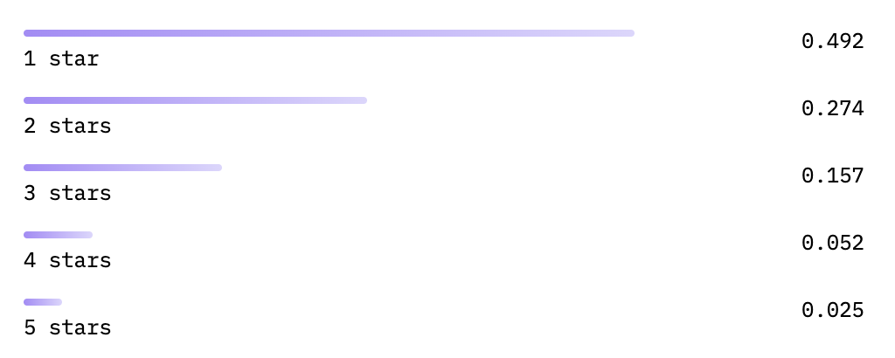

# 🌎 MoodMap 😍

## ✨ Project Details

**MoodMap** is a web app that lets you interactively view news sentiment trends over time on a map.
Our database contains articles the Guardian dating back to January 2019, and is updated each day with new articles.

Maps was built using [React](https://react.dev/) and [TypeScript](https://www.typescriptlang.org/).

News data was sourced from the [Guardian Open Platform](https://open-platform.theguardian.com/).

## 💻 Installation

To install MoodMap, you need to clone the repo from [GitHub](https://github.com/). Run the following commands in your terminal:

```shell
git clone https://github.com/zaultavangar/MoodMap.git
cd MoodMap
```

## 🏃🏾‍♂️💨 Running MoodMap Server

Before running the MoodMap server, you must install RabbitMQ locally. See this [link](https://www.rabbitmq.com/download.html)
for installation details. You must also replace the path passed into the "loadNationalitiesToCountriesMap" method in
the [NerService](./backend/src/main/java/com/example/backend/nerService/NerService.java)'s
constructor to your local absolute path to [countries.csv](./backend/data/countries.csv).

Once these steps are completed, to run the MoodMap server locally, run the following command in your
terminal from the top-level repository:

```shell
cd backend
npm run start
```

## 🏃🏾‍♂️💨 Running MoodMap Website

To run the MoodMap website locally, run the following command in your terminal:

```shell
cd frontend
npm run dev
```

## 🔬 Running Tests

### 🧪 Running Unit Tests

MoodMap uses [Vitest](https://jestjs.io/) for unit tests.

#### Frontend

To run the unit tests on the frontend, run the following command in your terminal:

```shell
cd frontend
npm run test:unit
```

### 🧪 Running End-to-End Tests

MoodMap uses [Playwright](https://playwright.dev/) for end-to-end tests.

To run the end-to-end tests, run the following command in your terminal:

```shell
cd frontend
npm run test:e2e
```

## Overview and Project Details

### Database Structure

We selected MongoDB as our database solution mainly due to its proficiency in handling complex, nested, and JSON-like data structures. Our database comprises two primary collections: 'Articles' and 'Features.' The 'Articles' collection archives the content fetched from the Guardian, encompassing a variety of elements such as titles, URLs, thumbnails, and textual content. Conversely, the 'Features' collection is dedicated to storing GeoJson features, which primarily represent geographical locations.

The structure of our database entities is outlined below. For a detailed implementation, refer to the [ArticleEntity](./backend/src/main/java/com/example/backend/entity/ArticleEntity.java) and [FeatureEntity](./backend/src/main/java/com/example/backend/entity/FeatureEntity.java).

- Article
  - ObjectId \_id (e.g. "507f1f77bcf86cd799439011")
  - LocalDateTime webPublicationDate (e.g. "2023-11-29 13:56:57.674")
  - String webTitle
  - String webUrl
  - String thumbnail
  - String bodyText
  - Double sentimentScore (e.g. 0.35)
  - List<String<st>> associatedLocations (e.g. ["France", "Germany"])
- Feature
  - ObjectId \_id (e.g. "507f1f77bcf86cd799439011")
  - String type (always equal to "Feature")
  - String location (e.g. "France")
  - [GeoJsonGeometry](./backend/src/main/java/com/example/backend/geocodingService/GeoJsonGeometry.java) geoJsonGeometry
  - Map<String,Object> properties (a map of strings to objects)

A key aspect of the 'Feature' collection is the properties field, which plays a pivotal role in the frontend visualization, such as determining the size and color of a feature's circle. This field stores the average sentiment of the articles mentioning a particular location for each month/year, thereby enriching our data representation on the frontend.

### Design Choices and Project Structure

#### Using Spring/Spring Boot

We decided to use Spring as our foundational framework primarily for its strong capabilities in crafting robust and well-documented REST APIs, managing database interactions, supporting depedency injection, and facilitating message brokering with tools like RabbitMQ. Perhaps most importantly, Spring Boot's approach to dependency injection, which allows components to be dynamically injected at runtime, not only streamlines the management of application dependencies but also promotes a modular architecture. This modular design is further enhanced by Spring's testing support, making it effortless to inject mock implementations for unit testing, thereby ensuring reliable and maintainable code. Spring simplifies the integration with various database technologies, offering a straightforward approach for managing database connections, executing queries, and implementing transactions. Using Spring Data JPA, we were able to greatly simplify the interaction with our MongoDB database. Furthermore, Spring's support for RabbitMQ is seamless. It provides abstractions for message-driven beans, allowing us to easily implement reliable messaging and asynchronous processing. This was particularly beneficial in the preprocesing of the articles, allowing us to decouple the addition and updating of articles and features in our database.

#### Key Project Components

- [ApiController](./backend/src/main/java/com/example/backend/controller/ApiController.java) is the REST controller
  that handles calls to our backend endpoints. For detailed documentation of these endpoints, start the backend
  application and navigate to [http://localhost:8080/swagger-ui/index.html](http://localhost:8080/swagger-ui/index.html). The
  endpoints used by the frontend are:
  - "/api/search": To search for articles based on some input phrase. Can be narrowed down using a date range as well.
  - "/api/searchByLocation": To search for articles based on a location (e.g. "France"). Can be narrowed down using a date range as well.
  - "/api/searchByDateRange": To search for articles based on a specified date range.
  - "/api/getFeatures": To retrieve the GeoJson features, i.e. locations and their properties, from the database.
- [ArticleDbService](./backend/src/main/java/com/example/backend/dbServices/ArticleDbService.java) is
  responsible for operations interacting with the Article collection in our database.
- [FeatureDbService](./backend/src/main/java/com/example/backend/dbServices/FeatureDbService.java) is
- responsible for operations interacting with the Feature collection in our database.
- [DbUpdaterService](./backend/src/main/java/com/example/backend/dbServices/DbUpdaterService.java) is
  responsible for operations that modify the feature and article documents in the database. This class and its methods are
  primarily used for preprocessing purposes, where feature and article documents need to be added, deleted, or modified.
  It receives messages from the RabbitMQ queue (containing articleIds) and adds features associated with an article
  as well as modifying the "sentimentScore" and "associatedLocations" fields in each article document as needed.
- [ArticleEntity](./backend/src/main/java/com/example/backend/entity/ArticleEntity.java), and
  [FeatureEntity](./backend/src/main/java/com/example/backend/entity/FeatureEntity.java) model the article and
  feature documents in our database.
- The [exceptions](./backend/src/main/java/com/example/backend/exceptions) directory contains a variety of
  exception classes that eases the handling, processing, and understanding of exceptions that are raised throughout
  the backend.
- [GeocodingService](./backend/src/main/java/com/example/backend/geocodingService/GeocodingService.java) is responsible
  for retrieving geocode results from the Google Maps Geocoding API based on a location string.
- [GuardianService](./backend/src/main/java/com/example/backend/guardianService/GuardianService.java) is responsible
  for articles from the Guardian API.
- [JsonUtility](./backend/src/main/java/com/example/backend/jsonUtility/JsonUtility.java) contains
  utility methods for reading JSON strings into objects and serializing objects in JSON strings.
- [NerService](./backend/src/main/java/com/example/backend/nerService/NerService.java) is responsible for
  (1) retrieving and processing sentiment responses from the Hugging Face API, and (2) performing Named
  Entity Recognition (NER) on article headlines in order to extract and process location entities.
- The [processors](./backend/src/main/java/com/example/backend/processors) directory contains the
  [Processor](./backend/src/main/java/com/example/backend/processors/Processor.java) and
  [Preprocessor](./backend/src/main/java/com/example/backend/processors/Preprocessor.java) classes, which,
  as their name indicates, are responsible for processing the articles fetched from the Guardian and calling
  the appropriate services to add and modify article and feature documents in the DB. It is called from the
  "processArticles" endpoint as well as the daily task scheduler, and is used solely for the purpose of
  processing articles and interacting with the database.
- [ArticleRepository](./backend/src/main/java/com/example/backend/repositories/ArticleRepository.java) and
  [FeatureRepository](./backend/src/main/java/com/example/backend/repositories/FeatureRepository.java) includes
  all the needed CRUD operations for interacting with the database and is the link between our database and the
  rest of the backend.
- [ScheduleArticleTask](./backend/src/main/java/com/example/backend/scheduledTask/ScheduledArticleTask.java) uses
  a CRON job to process new articles from the Guardian once a day.
- The [validator](./backend/src/main/java/com/example/backend/validator) directory contains classes and interfaces
  used for validating requests to our backend API endpoints.

### Preprocessing

Much of the work on the backend was the preprocessing of the Guardian articles. Articles were fetched via the [Guardian API](https://open-platform.theguardian.com/). After performing natural language processing and geocoding (explained in more detail below), the articles and their associated locations (structured very similarly to GeoJSON features) were added to the Article and Feature collections in our MongoDB database, respectively.

#### Natural Language Processing (NLP)

##### Named Entity Recognition (NER)

To compensate for the lack of geographic data in the Guardian API, we employed Named Entity Recognition (NER) using Stanford NLP's [Simple API](https://stanfordnlp.github.io/CoreNLP/simple.html) on each article's headline. This method allowed us to pinpoint and capture location-based entities, effectively connecting articles to specific geographical areas. The API analyzes each headline and assigns entity tags (like PERSON, LOCATION, etc.) to words. Words tagged as locations – encompassing countries, states, cities, or provinces – were cataloged. Moreover, nationalities identified by the API were converted into corresponding locations using an online nationality-to-country mapping. These identified locations then populated the 'associated_locations' field in our Article document and were further utilized in populating our database's Feature collection, as detailed in the [Geocoding section](#forward-geocoding).

#### Sentiment Analysis

We utilized Hugging Face's API, specifically the [Bert Base Multilingual Uncased Sentiment Model](https://huggingface.co/nlptown/bert-base-multilingual-uncased-sentiment), to assign sentiment scores to articles. The model evaluates both the headline and body text (limited to 512 characters) and provides a structured response, as depicted below.



The model assigns a sentiment score ranging from 1 (most negative) to 5 (most positive), accompanied by corresponding probabilities. We calculated a normalized weighted average sentiment score using the formula below, with the score ranging from 0 (most negative) to 1 (most positive). This score was then linked to the respective article in our database.

$$\[ \text{Normalized Weighted Average} = \frac{ \sum (\text{star}_i \times \text{score}_i) - 1}{4} \]$$

$$\text{where} \; \text{star}_i = \text{First character of label of the ith sentiment converted to an integer}$$

$$\text{and} \; \text{score}_i = \text{Score of the ith sentiment}$$

### Forward Geocoding

Following the location association outlined in the [NER section](#named-entity-recognition-ner), we aimed to pinpoint the exact coordinates of each location using the [Google Maps Geocoding API](https://rapidapi.com/googlecloud/api/google-maps-geocoding) via [Rapid API](https://rapidapi.com/hub). Initially, we tried Mapbox's Geocoding API but switched due to inconsistencies in its results. Each location linked to an article prompted an API call. The response included a [GeoJson Point](https://datatracker.ietf.org/doc/html/rfc7946#section-3.1.2) with coordinates and a formatted location name. Successful extractions led to the addition of these features into our database's Feature collection.

### Processing Technique

For efficiency and cost considerations, we segmented our processing into 10 distinct batches. Each year's data retrieval involved two API calls: one for articles from June 1st to December 31st, and another for January 1st to May 31st. This approach, spanning five years (2019-2023), necessitated a total of 10 API calls to the Guardian. Typically, each call yielded approximately 6,000 to 7,000 articles. Given the extensive volume of articles and the complexity involved in processing them, our goal was to maximize efficiency and ensure robust error handling. To achieve this, we employed [RabbitMQ](https://www.rabbitmq.com/), an online message broker, which primarily facilitated the segregation of article addition and feature updates in our database.

#### Preprocessing with RabbitMQ

In preprocessing past articles, we separated the database operations - specifically the addition and updating of articles and features. Here's an outline of our preprocessing workflow:

- Post retrieval from the Guardian API, each article was initially stored in our database sans sentiment score or associated location list.
- Upon adding an article, our [Processor](./backend/src/main/java/com/example/backend/processors/Processor.java) dispatches a message via RabbitMQ to the article queue, containing the article's database ID.
- The [Preprocessor](./backend/src/main/java/com/example/backend/processors/Preprocessor.java) picks up this ID, extracts the corresponding article from the database, and executes the required processes (Sentiment Analysis, NER, and Geocoding).
- Articles not linked to any location are removed from the database. Conversely, those associated with locations are updated with their respective sentiment scores and location lists.

#### Daily Processing

Our approach for daily processing diverges from the above method, primarily due to the lower volume of articles retrieved daily from the Guardian API (around 30 articles). This smaller scale negated the need for a message broker like RabbitMQ. For daily updates, we directly retrieve articles, conduct NLP tasks and geocoding, and then simultaneously add the articles along with their corresponding features to the database. This process differs from our batch preprocessing by eliminating the initial step of adding and subsequently updating articles in the database. The daily extraction of articles from the Guardian, targeting the current day's publications, is systematically conducted at 5 PM Eastern Standard Time (EST). (SUBJECT TO CHANGE).

#### Average Sentiment Calculation

You may wonder how we manage to showcase the average sentiment of articles that reference a specific location, displayed by month or year, on our frontend. This process is streamlined as follows: each time a new article is added to our database (in the case of preprocessing), or fetched from the Guardian API (in the case of daily processing), we simultaneously update the 'properties' section within the relevant feature(s). These 'properties' act as a storage map, cataloging not only the cumulative number of articles mentioning the location for a given month but also the collective average sentiment score derived from these articles. As we add more articles, the corresponding feature's 'properties' are dynamically adjusted, ensuring that both the article count and the average sentiment for that month are kept up-to-date.

## Backend Tests (unit, integration, random)

- Unit tests && Integration tests && random tests:
  - ApiControllerTest:
    - The [ApiControllerIntegrationTest](./backend/src/test/java/com/example/backend/controller/ApiControllerIntegrationTest.java)
      class contains a set of unit tests for testing the API controller's integration with the actual services. It includes tests for
      various scenarios, such as successful responses, server errors, missing parameters, and invalid input. The tests use Mockito to
      mock the behavior of the database services and verify the correctness of the API responses. Each test method focuses on a specific
      aspect of the controller's functionality, making it easier to identify and fix issues during development.
      The [ApiControllerUnitTest](./backend/src/test/java/com/example/backend/controller/ApiControllerUnitTest.java) class, on the
      other hand, contains unit tests for the API controller in isolation from the actual services. These tests focus on the controller's
      methods and their behavior without interacting with the database. They cover scenarios such as successful responses, failure
      responses, and edge cases like empty input parameters or invalid date formats. Mockito is used to mock the services, ensuring that
      the controller's logic is tested independently. Both classes follow a structured approach to testing, ensuring that the API
      controller functions correctly under various conditions and providing valuable feedback to developers during the development process.
      [ApiControllerRandomTest](./backend/src/test/java/com/example/backend/controller/ApiControllerRandomTest.java) contains a random test
      that generates random start and end date inputs for the "searchByDateRange" endpoint and ensures they all result in bad requests.
  - DbServiceTest:
    - The [ArticleDbService](./backend/src/main/java/com/example/backend/dbServices/ArticleDbService.java) and
      [FeatureDbService](./backend/src/main/java/com/example/backend/dbServices/FeatureDbService.java) classes in
      the dbServices package are integral components of a backend system, primarily focused on database operations
      related to articles and geographical features, respectively. ArticleDbService provides functionality for
      saving, retrieving, and querying article entities, supporting operations like full-text search, filtering by
      date ranges, and handling individual or bulk article data. On the other hand, FeatureDbService manages
      geographical feature data, enabling the saving and retrieval of feature entities, and offers methods for
      querying features by location and creating new feature entities with geographic coordinates. Both services
      interact with their respective MongoDB repositories, encapsulating the database logic and offering a clean
      interface for the higher-level application components. These services are essential for handling data persistence
      and retrieval, ensuring the smooth functioning of the backend application in managing articles and geographical features.
      [DbUpdaterService](./backend/src/main/java/com/example/backend/dbServices/DbUpdaterService.java) is also a key component
      of the backend as it is the most important component of our processing/preprocessing scheme.
      The tests in the [dbServices](./backend/src/test/java/com/example/backend/dbServices) unit test the methods in each of
      the services mentioned above to ensure they operate and handle errors correctly.
  - EntityTest:
    - The [FeatureEntityTest](./backend/src/test/java/com/example/backend/entity/FeatureEntityTest.java) class is
      designed to verify the functionality of the [FeatureEntity](./backend/src/main/java/com/example/backend/entity/FeatureEntity.java)
      class in a Spring Boot context. It focuses on testing the property manipulation methods of FeatureEntity, ensuring they operate
      correctly. The tests include checking the successful addition of a location property, the correct update and retrieval of a
      double value property, and the appropriate handling of invalid keys during property retrieval. These tests collectively
      ensure that the FeatureEntity class handles and stores geographical feature data accurately and reliably. This suite is
      essential for maintaining the integrity of the data handling aspect of the application.
      [ArticleEntityTest.java](./backend/src/test/java/com/example/backend/entity/ArticleEntityTest.java) just tests a
      simple method in [ArticleEntity](./backend/src/main/java/com/example/backend/entity/ArticleEntity.java) that
      clears the body text of an ArticleEntity object. This is useful as after using the body text for sentiment analysis, we don't
      want to store that text in the database, for the sake of efficiency and storage space.
  - GeoCodingServiceTest:
    - The [GeocodingServiceTest](./backend/src/test/java/com/example/backend/geocodingService/GeocodingServiceTest.java) class
      is focused on validating the functionality of the [GeocodingService](backend/src/main/java/com/example/backend/geocodingService/GeocodingService.java)
      in handling geocoding requests and responses. It includes tests for both successful and failed scenarios, ensuring that the
      service correctly processes valid responses and properly handles errors. Mocking is extensively used to simulate responses
      from an external geocoding API, allowing for precise control over the input and expected outcomes. These tests verify that
      the service can accurately parse and return geocoding data and throw exceptions as expected in failure scenarios. Overall,
      this test suite ensures the robustness and reliability of the geocoding feature within the application.
  - JsonUtilityTest:
    - The [JsonUtilityTest](./backend/src/test/java/com/example/backend/jsonUtility/JsonUtilityTest.java) class  
      is focused on testing the functionality of JSON serialization and deserialization within the application.
      It includes tests for reading JSON strings and converting them into Java objects (a sample Person class in this case),
      ensuring accurate mapping of JSON properties to object attributes. Additionally, it tests the reverse process of c
      converting a Java object back into a JSON string, checking for the correct inclusion and formatting of object
      properties in the resultant JSON. The class employs simple test cases with straightforward object structures to
      verify the utility's effectiveness in handling JSON data. Overall, these tests are crucial for validating the
      reliability and accuracy of JSON processing in the application's data handling layers.
  - NerServiceTest:
    - The [NerServiceTest](./backend/src/test/java/com/example/backend/nerService/NerServiceTest.java) class
      focuses on testing the Named Entity Recognition (NER) and sentiment analysis capabilities of the
      NerService. It includes tests for successful API requests and handling of various failure scenarios,
      such as non-2xx responses and format errors in the API response. The class validates the extraction
      of entities, including locations and nationalities, from text inputs, and checks the accuracy of
      sentiment scores calculated from the responses. Additionally, it ensures robustness in handling empty
      or irrelevant inputs, demonstrating the service's reliability in diverse situations.
  - ProcessorTest:
    - The [ProcessorTest](./backend/src/test/java/com/example/backend/processor/ProcessorTest.java) class focuses
      on testing the Processor class, which is integral in handling article processing from the Guardian API.
      Key functionalities tested include validating proper handling of valid and invalid date ranges,
      processing of articles with and without associated features, and handling API responses, including
      empty or failed ones. The tests also cover scenarios where articles have no associated locations, ensuring
      the processor behaves correctly in diverse situations. The class extensively uses Mockito to mock dependencies
      like GuardianService and DbUpdaterService, facilitating isolated testing of the Processor logic. Overall,
      these tests ensure the robustness and reliability of the article processing pipeline, crucial for
      maintaining the integrity of the application's data processing flow.
  - ScheduledArticleTaskTest:
    - The [ScheduleArticleTaskTest](./backend/src/test/java/com/example/backend/scheduledTask/ScheduledArticleTaskTest.java)
      class tests the functionality of a scheduled task in a backend application. This test focuses on
      validating that the scheduled task triggers article processing for a specific day, ensuring it
      correctly calls the article processing function with the current date. The test makes use of
      Mockito for mocking dependencies and asserts that the processor is invoked correctly with the
      expected date parameters. The aim is to ensure that the scheduled task behaves as intended,
      processing articles daily without errors.
  - RequestValidatorTest:
    - The [RequestValidatorTest](./backend/src/test/java/com/example/backend/validator/RequestValidatorTest.java)
      class contains a series of unit tests for the RequestValidator class, which is responsible for validating
      search requests. The tests cover various scenarios, including input validation, date range validation, and
      checks for the presence and consistency of dates in requests. The tests use the JUnit framework and assert
      the expected validation results using assertEquals. This comprehensive test suite ensures that the request
      validation functions correctly and handles different input scenarios as expected, helping to maintain the
      reliability of the request validation process in the application.

## Frontend Tests (unit, integration, random, e2e)

- Unit tests
  - useDatePicker test:
    - The useDatePicker suite tests the pure functions within the useDatePicker hook. The tests makes sure:
      - that the DatePicker will be resize correctly according to a given breakpoint
      - that it will correctly change the selected month
      - that the DatePicker can correctly go back and forth by year
  - useLocationPopup test:
    - The useLocationPopup suite tests the
  - useMapManager test:
    - The useMapManager suite tests the pure functions within the useMapManager hook. It makes sure that the map can correctly generate the necessary feature collection needed to display the heatmap locations on the map.
  - useOverviewPanel test:
    - The useOverviewPanel suite tests the pure functions within the useOverviewPanel hook. It makes sure that:
      - that it correctly selects the sentiment and number of articles of a given location based on a given date
      - that it correctly filters the collection of locations into trending categories (most mentioned, most positive, most negative)
- Integration tests
  - API test:
    - The API suite tests all the used backend endpoints. For each endpoint, the fetch function is mocked, returning a mock response saved in the `__mocks__` folder.
- End-to-End tests
  - DatePicker test:
    - The DatePicker suite does basic tests to make sure:
      - that the DatePicker is visible when loaded
      - that the calendar months are visible
      - that the end user can go back and forth to different years
      - that a given month can be selected
  - Map test:
    - The Map suite does basic tests to make sure:
      - that the Map is visible when loaded
    - Note that we couldn't test clicking a given heatmap location on the map. Mapbox renders the map as a canvas element, making the heatmap layer [non-DOM traversable and leads to accessibility issues](https://maps4html.org/HTML-Map-Element-UseCases-Requirements/#ref-for-accessibility-potential-3:~:text=existing%20implementations%20vary%20widely%20in%20how%20they%20implement%20markers%20and%20annotations.%20this%20lack%20of%20consistency%20has%20the%20potential%20to%20lead%20to%20accessibility%20issues%2C%20as%20there%20may%20be%20no%20clear%20way%20for%20the%20information%20the%20marker%20is%20intended%20to%20denote%20to%20be%20accessed%20by%20assistive%20technologies.). This is a well-known problem and there is [proposal from the W3c for a native map implementation that fixes these issues](https://maps4html.org/); however, the proposal is too unstable for use in production.
  - OverviewPanel test:
    - The OverviewPanel suite makes sure that:
      - it is visible when laoded
      - it is collapsible
  - Searchbar test:
    - The Searchbar suite makes sure that:
      - it is visible when loaded
      - an end user can type in a search keyword
      - when a keyword is entered, the search results are visible
      - an end user can toggle whether the searchbar filters based on a date range

## 🥵 Contributors

Made with 💖 by Nico, Zaul, and Asher
